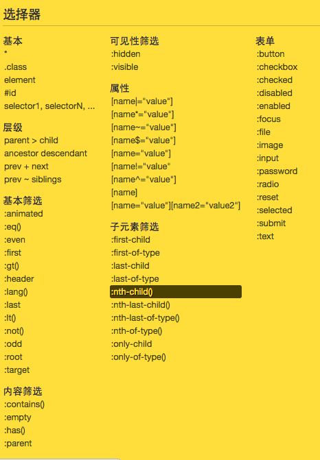

# jQuery 温故知新


## 选择器 ↓
### jQuery 选择器分为五大部分:基本,层级,表单,属性,筛选(基本,内容,可见性,子元素)



## 选择方法
```
.eq(index)
.get([index])
```
##### 对于一个特定结果集，我们想获取到指定index的jQuery对象，可以使用eq方法.

$('div').eq(3); // 获取结果集中的第四个jQuery对象

##### 我们可以通过类数组下标的获取方式或者get方法获取指定index的DOM对象，也就是我们说的jQuery对象转DOM对象

$('div')[2]; //获取结果集中的第三个 DOM 对象
$('div').get(2);
get()不写参数把所有对象转为DOM对象返回

```
.next([selector])
.prev([selector])
```
##### next取得匹配的元素集合中每一个元素紧邻的后面同辈元素的元素集合。如果提供一个选择器，那么只有紧跟着的兄弟元素满足选择器时，才会返回此元素。prev正好相反，获取元素之前的同辈元素

$('.test').next();
$('.test').prev('li');
```
.nextAll([selector])
.prevAll([selector])
```
##### nextAll获得每个匹配元素集合中每个元素所有后面的同辈元素，选择性筛选的选择器，prevAll与之相反，获取元素前面的同辈元素
```
.siblings([selectors])
```
##### 获得匹配元素集合中每个元素的兄弟元素,可以提供一个可选的选择器

$('li.third-item').siblings()

```
.parent([selector])
```
##### 取得匹配元素集合中，每个元素的父元素，可以提供一个可选的选择器

$('li.item-a').parent()
```
.parents([selector])
```
##### 获得集合中每个匹配元素的祖先元素，可以提供一个可选的选择器作为参数

$('li.item-a').parents('div')
```
.children([selector])
```
##### 获得匹配元素集合中每个元素的子元素，选择器选择性筛选

$('ul.level-2').children()
```
.find([selector])
```
##### 查找符合选择器的后代元素

$('ul').find('li.current');

```
.first()
```
##### 获取当前结果集中的第一个对象
```
.last()
```
##### 获取当前结果集的最后一个对象
```
.filter(selector)
.filter(function(index))
```
##### 筛选当前结果集中符合条件的对象，参数可以是一个选择器或者一个函数

$('li').filter(':even')

$('li').filter(function(index) {
  return index % 3 == 2;
})
```
.not(selector)
.not(function(index))
```
##### 从匹配的元素集合中移除指定的元素，和filter相反
```
.is(selector)
.is(function(index)).
.is(dom/jqObj)
```
##### 判断当前匹配的元素集合中的元素，是否为一个选择器，DOM元素，或者jQuery对象，如果这些元素至少一个匹配给定的参数，那么返回true

```
.has(selector)
.has(dom)
```
#####筛选匹配元素集合中的那些有相匹配的选择器或DOM元素的后代元素

$('li').has('span')