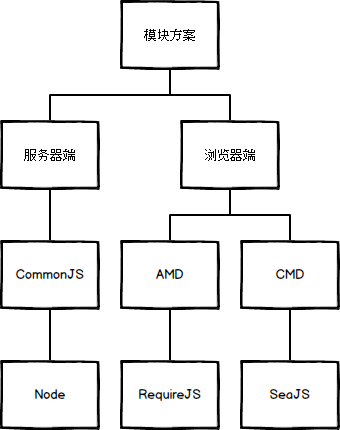

# AMD 与 CMD 规范



### 区别

- CMD  就近依赖 延迟执行
- AMD  依赖前置 提前执行

```

//CMD
define(function(require,exports,module){
  var a=require('./a')
  a.doSomethimg()
  var b=require('./b')
  b.doSomething()
  })

//AMD
define(['./a','./b'],function(a,b){
  a.doSomething()
  b.dosomething()
  })

```


###### AMD和CMD最大的区别是对依赖模块的执行时机处理不同,注意不是加载的时机或者方式不同

加载模块都是异步的,只不过AMD依赖前置,js可以方便知道依赖模块是谁,立即加载,而CMD就近依赖,需要使用把模块变为字符串解析一遍才知道依赖了那些模块,这也是很多人诟病CMD的一点,牺牲性能来带来开发的便利性,实际上解析模块用的时间短到可以忽略

同样都是异步加载模块,AMD在加载模块完成后就会执行该模块,所有模块都加载执行完后会进入require的回调函数,执行主逻辑,这样的效果就是依赖模块的执行顺序和书写顺序不一定一致,看网络速度,哪个先下载下来,哪个先执行,但是主逻辑一定在所有依赖加载完成后才执行

CMD加载完某个依赖模块后并不执行,只是下载而已,在所有依赖模块加载完成后进入主逻辑,遇到require语句的时候才执行对应的模块,这样模块的执行顺序和书写顺序是完全一致的


### AMD 规范

实际上AMD 是 RequireJS 在推广过程中对模块定义的规范化的产出

- 主要解决两个问题:

1. 多个js文件可能有依赖关系,被依赖的文件需要早于依赖它的文件加载到浏览器
2. js加载的时候浏览器会停止页面渲染,加载文件越多,页面失去响应时间越长

AMD (Asynchronous Module Definition,异步模块定义) 指定一种机制,在该机制下模块和依赖可以异步加载.这对浏览器端的异步加载尤其适用.

根据AMD规范,我们可以使用define定义模块,使用require调用模块,语法:

- define(id?,dependencies?,factory);

id: 定义中模块的名字;可选；如果没有提供该参数,模块的名字应该默认为模块加载器请求的指定脚本的名字.

依赖dependencies：是一个当前模块依赖的,已被模块定义的模块标识的数组字面量;依赖参数是可选的,如果忽略此参数,它应该默认为["require","exports","module"].然而,如果工厂方法的长度属性小于3,加载器会选择以函数的长度属性指定的参数个数调用工厂方法.

工厂方法factory,模块初始化要执行的函数或对象.如果为函数,它应该只被执行一次.如果是对象,此对象应该为模块的输出值.

define是全局变量,用来定义模块,在页面上使用require函数加载模块

- require([dependencies],function(){});

第一个参数是一个数组,表示所依赖的模块
第二个参数是一个回调函数,当前面指定的模块都加载成功后,它将被调用.加载的模块会以参数形式传入该函数,从而在回调函数内部就可以使用这些模块

require()函数在加载依赖的函数的时候是异步加载的,这样浏览器不会失去响应,它指定的回调函数,只有前面的模块都加载成功后,才会运行,解决了依赖性的问题

示例1:

```
define('modal',['jQuery','dialog'],function($,Dialog){
    $('.modal').show();
    Dialog.open();
});
```

示例2:

```
// 定义模块 myModule.js
define(['dependency'],function(){
    var name = 'Byron';
    function printName(){
        console.log(name);
    }

    return {
        printName: printName
    };
});
```

```
// 加载模块
require(['myModule'],function (my){
　 my.printName(); });
```

### CMD 规范

CMD 即Common Module Definition通用模块定义,CMD规范是国内发展出来的,就像AMD有个requireJS,CMD有个浏览器的实现SeaJS,SeaJS要解决的问题和requireJS一样,只不过在模块定义方式和模块加载（可以说运行、解析）时机上有所不同

在 CMD 规范中,一个模块就是一个文件.代码的书写格式如下：

define

- define(id?,dependencies?,factory)

1. 因为CMD推崇一个文件一个模块,所以经常就用文件名作为模块id

2. CMD推崇依赖就近,所以一般不在define的参数中写依赖

3. 在factory中写三个参数

- function(require,exports,module)


require 是一个方法,用来获取其他模块提供的接口

exports 是一个对象,用来向外提供模块接口

module 是一个对象,上面存储了与当前模块相关联的一些属性和方法

示例1:

```
// math.js

define(function(require,exports,module) {
  exports.add = function() {
    var sum = 0,i = 0,args = arguments,l = args.length;
    while (i < l) {
      sum += args[i++];
    }
    return sum;
  };
});
```

```
// increment.js

define(function(require,exports,module) {
  var add = require('math').add;
  exports.increment = function(val) {
    return add(val,1);
  };
});
```

```
// program.js

define(function(require ,exports,module) {
  var inc = require('increment').increment;
  var a = 1;
  inc(a); // 2

  module.id == "program";
});
```

示例2:

```
// 定义模块  myModule.js
define(function(require,exports,module) {
  var $ = require('jquery.js')
  $('div').addClass('active');
});
```

```
// 加载模块
seajs.use(['myModule.js'],function(my){

});
```

### CommonJS 规范(服务器端)

CommonJS是服务器端模块的规范,Node.js采用了这个规范.Node.JS首先采用了js模块化的概念.

CommonJS定义的模块分为:模块引用(require)/ 模块定义(exports)/模块标识(module)


示例:
```
//math.js

exports.add = function() {
    var sum = 0,i = 0,args = arguments,l = args.length;
    while (i < l) {
        sum += args[i++];
    }
    return sum;
};
```
```
//increment.js

var add = require('math').add;
exports.increment = function(val) {
    return add(val,1);
};
```
```
//program.js

var inc = require('increment').increment;
var a = 1;
inc(a); 
```

- 浏览器不兼容CommonJS的根本原因，在于缺少四个Node.js环境的变量。
1. module
2. exports
3. require
4. global