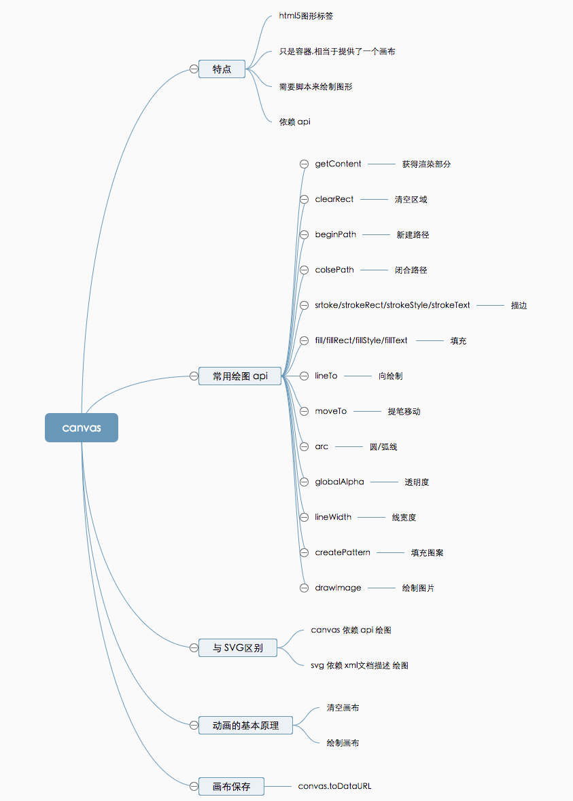
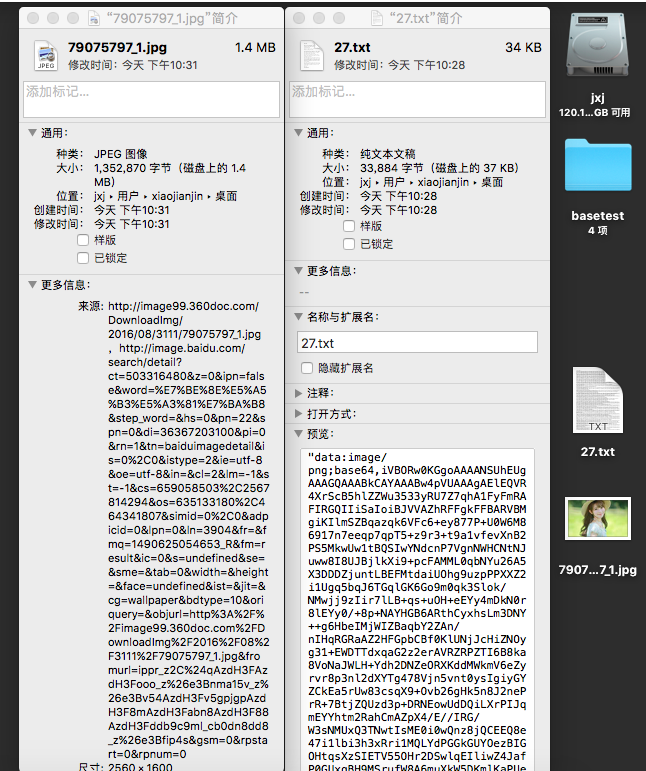

# 应用前端技术制作缩略图

## 众所周知 canvas 是 html5 的一项新的绘图技术

### canvas 可以进行较复杂的绘图;利用这项技术可以作动画/作游戏



### 但是 canvas 还能有其他应用,本次说的就是利用此项技术进行轻量级的前端图片压缩

##### 用户图片先在页面显示，然后再获取图片的数据，放入已经创建设置好大小的 canvas 画布中(可以是隐藏状态的)， 保存画布图像;从而实现了压缩.压缩后为 base64格式更适合传输.

##### 不足
1. 这种方法图片不能太小,否则压缩反而变大
2. 必须是支持 html5 的浏览器
3. toDataURL输出的是 base64格式不是太灵活


js
```

       
function imgToMin(files, id) {
    // 建立绘图空间
    var cnv = document.getElementById('myCanvas')
    var cntx = cnv.getContext('2d')

    var imgNew = new Image()
    var imgAgo = document.getElementById('ago')

    for (var i = 0; i < files.length; i++) {
        var file = files[i]
        var reader = new FileReader()
        reader.readAsDataURL(file)
        // FileReader 对象允许Web应用程序异步读取存储在用户计算机上的文件（或原始数据缓冲区）的内容，使用 File 或 Blob 对象指定要读取的文件或数据
        // readAsDataURL开始读取指定的Blob中的内容。一旦完成，result属性中将包含一个data: URL格式的字符串以表示所读取文件的内容
        reader.onload = function(e) {
            url = e.target.result
            imgNew.src = url
            imgAgo.src = url
            imgAgo.onload = function() {
                var m = imgNew.width / imgNew.height
                cnv.height = 100
                cnv.width = 100 * m
                cntx.drawImage(imgAgo, 0, 0, 100 * m, 100)
            }
        }
    }
}

function imgInfo() {
    var img = document.getElementById('myCanvas').toDataURL('image/png')
    var img2 = document.getElementById('press')
    img2.src = img
    console.log(`压缩后${parseInt(img.length/1024)}kb`)
}

```

html
```
    <input type="file" id="fileId" name="fileId" value="上传图片" hidefocus="true" onchange="imgToMin(this.files,this.id);" />
    <canvas id="myCanvas" style="display: none"></canvas>
    
    <input type="button" value="压缩" onclick="imgInfo()" />
    
```

### 1m 的图片缩小到30k, 有意思吧




## jxjweb.top