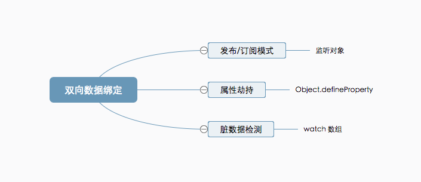

# js实现双向绑定

JavaScript实现简单的双向绑定的方式:

1.发布/订阅模式

发布与订阅模式又叫观察者模式,他定义对象间的一种一对多关系,让多个观察者对象同时监听某一个存储的事件,当事件被触发, 绑定监控的事件都会被触发

实现思路是:建立一个对象,在对象中保存需要监听的事件及事件触发的回调函数,有需要监听的事件将其绑定得到存储对象中,当事件被触发时,找到触发事件的回调函数并运行

2.属性劫持

需要应用`Object.defineProperty`方法,通过定义其中的 get/set 方法,来监控 model 部分的数据变化,用以同步 view 部分;是目前前端框架常用的数据绑定方式

3.脏数据检测

这是老版本的 angularJS 使用的数据绑定方式,将需要监听的数据注入到一个`watch`数组中,当数据变换时,对比数组的变化,找出变化的数据加以处理;但是由于先天劣势,当需要检测的值太多时会严重影响性能,是一种过时的方式

