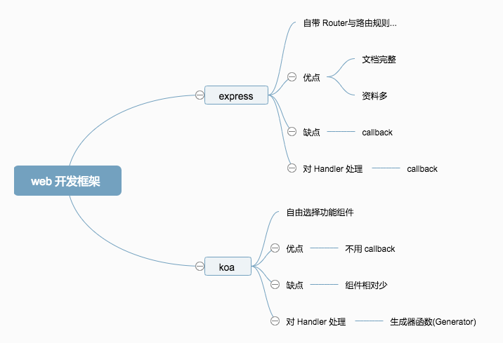

# koa 与 express区别？

Koa 虽然同它哥 Express 说的一样，是 Web Framework.

不过从架构功能设计和架构设计上看，它更像它舅舅── Connect.

更多是一个中间件框架，其提供的是一个架子，而几乎所有的功能都需要由第三方中间件完成.

 Express 更为贴近 Web Framework 这一概念，比如自带 Router、路由规则等；相比之下 Koa 则更为宽松，光是 Router 就有 20+ 个，自由选择嘛，更为灵活.

Express 和 Koa 最明显的差别就是 Handler 的处理方法，一个是普通的回调函数，一个是利用生成器函数（Generator Function）来作为响应器.

往里头儿说就是 Express 是在同一线程上完成当前进程的所有 HTTP 请求，而 Koa 利用 co 作为底层运行框架，利用 Generator 的特性，实现“协程响应”（并不能将 Generator 等价于协程，在 V8 的邮件列表中对 Generator 的定义基本是 coroutine-like），然而 co 这个库对 Generator 的使用方法并非当初 Generator 的设计初衷.
 

1. Express：
优点：历史更久，文档更完整，资料更多，深入人心
缺点：不能忍的 callback

2. Koa：
优点：没有回调函数 
缺点：Connect/Express 的中间件基本不能重用，基本要重写；依然需要更多人的支持和学习

express就是组合了很多功能的koa

koa唯一多了的一个功能就是中间件可以像洋葱一样嵌套