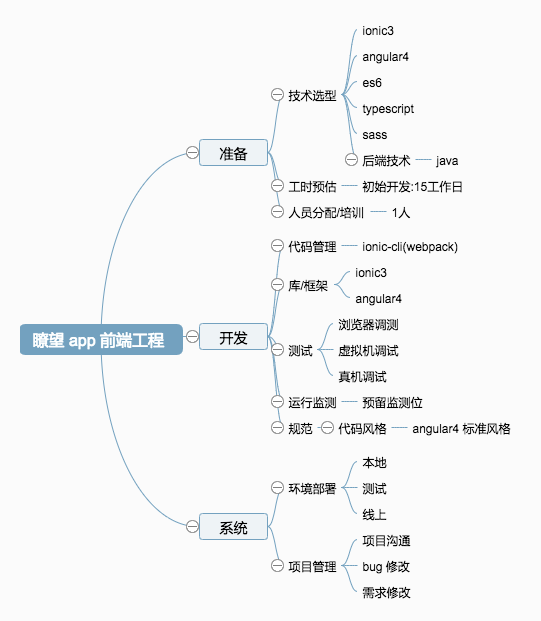

# 项目架构

 架构（software architecture）是一系列相关的抽象模式，用于指导大型软件系统各个方面的设计。

 软件架构是一个系统的草图。

 软件架构描述的对象是直接构成系统的抽象组件。

 各个组件之间的连接则明确和相对细致地描述组件之间的通讯。
 在实现阶段，这些抽象组件被细化为实际的组件，比如具体某个类或者对象。在面向对象领域中，组件之间的连接通常用接口来实现。 

很难明确地区分设计和构架：构架属于设计的一方面，它集中于某些具体的特征。

一般而言，软件系统的架构（Architecture）有两个要素：

1.它是一个软件系统从整体到部分的最高层次的划分。

一个系统通常是由元件组成的，而这些元件如何形成、相互之间如何发生作用，则是关于这个系统本身结构的重要信息。详细地说，就是要包括架构元件（Architecture Component）、联结器（Connector）、任务流（Task-flow）。所谓架构元素，也就是组成系统的核心"砖瓦"，而联结器则描述这些元件之间通讯的路径、通讯的机制、通讯的预期结果，任务流则描述系统如何使用这些元件和联结器完成某一项需求。

2.建造一个系统所作出的最高层次的、以后难以更改的，商业的和技术的决定。

在建造一个系统之前会有很多的重要决定需要事先作出，而一旦系统开始进行详细设计甚至建造，这些决定就很难更改甚至无法更改。显然，这样的决定必定是有关系统设计成败的最重要决定，必须经过非常慎重的研究和考察。

架构是一个演变的过程。
它指的不是随着历史的演变，而是随着项目演变。
通常说架构，指的是架构模式，自创的架构很少。
