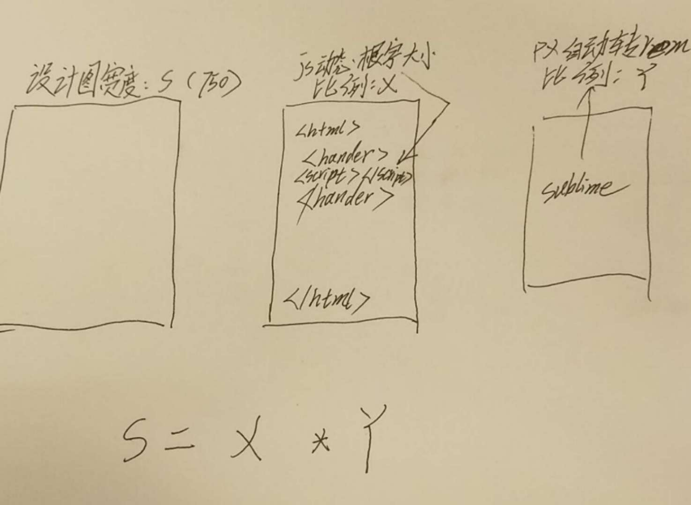
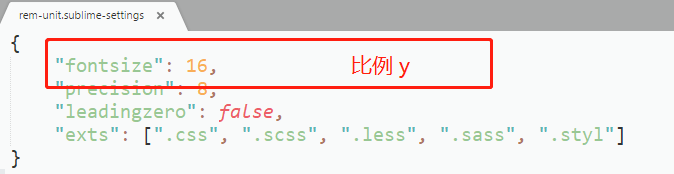

# 关于 rem 比例计算

### rem 的计算通常是:
设计图宽度(移动端设计图一般为750px) / 根字体计算js计算比例 = px自动转rem比例

### 其他注意的细节
1.在设计图宽度下计算的根字体大小应该在30px左右;如果太小,因为在小分辨率浏览器里,计算出的根字体大小如果小于12px会被一些浏览器强制覆盖为12px, 使得动态计算失效.计算的根字体太大,可能产生更多误差.
2.尽可能避免直接在源码里转rem, 转 rem 会导致与设计图的联系被割裂,导致后期升级/修改困难.
