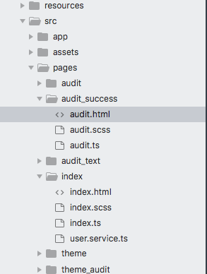
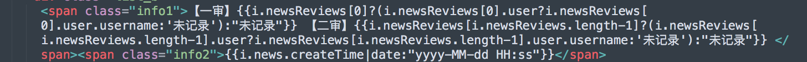

# 问题反馈

## 手机审核反了的问题

源码:


### 是因为接口收到的审核员信息是反的,请检查对应的手机接口,是不是把 newsReviews数组 查询时处理反了

如果坚持这种数据:
那前端就这么改:(调转):

```
      <div class="list_b" *ngIf='i.news.id!=audited'>
        <span class="info1">【一审】{{i.newsReviews[i.newsReviews.length-1]?i.newsReviews[i.newsReviews.length-1].user.username:''}}</span><span class="info2">{{i.news.createTime|date:"yyyy-MM-dd HH:ss"}}【二审】{{i.newsReviews[0]?i.newsReviews[0].user.username:""}} </span>
      </div>
```

## 无法切换

### 排查:进入首页,点击顶部超过十次,调出调试框,看一下数据是不是完整
### 检查后台:是不是逻辑或则数据变了