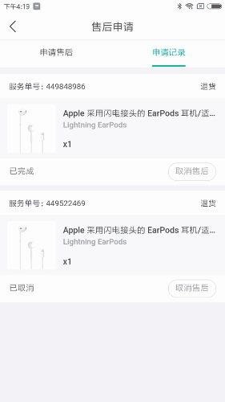

### 好分期3.0 项目复盘总结

* 项目分配的相关

​项目分配应该遵循一人分配一个方面,应该尽量避免将项目切细平均分配,这样有利于个人熟悉一方面的项目技术及相关组件,提高工作效率

* 前端工程的组件化

对于前端项目应该提前规划好前端的相关结构并留下冗余,根据项目难易程度制定组件细化程度,避免重复修改.组件化是持续完善的过程，但需要充分考虑业务扩展的情况做好评估，不能盲目组件化，为以后功能扩展带来维护的复杂度

* 第三方组件的有效利用

对于第三方组件应该确定好到底是不是使用哪些组件,调整好组件的细节,以符合设计/产品意图;并且一定要明白所用技术的思想,做到大体明确,心里有数.同时项目后续会继续引入优秀的开源框架/组件库，需要大家提前学习和尽快掌握，提高个人的技术能力和团队的效率

 
* 与后端/客户端的配合

与其他技术交互应提前规划好变量名,并一定要制定变量名命名规范,本次项目对接过程中,变量名命名驼峰与下滑线混在一起,连接处理会浪费不必要的经历与时间.为了提高团队配合效率，希望和帅哥及各端一起推动接口协议评审

* 散碎时间的优化利用

在调试时经常遇到测试反馈一些小问题,就停掉现在工作,切换处理,降低了效率