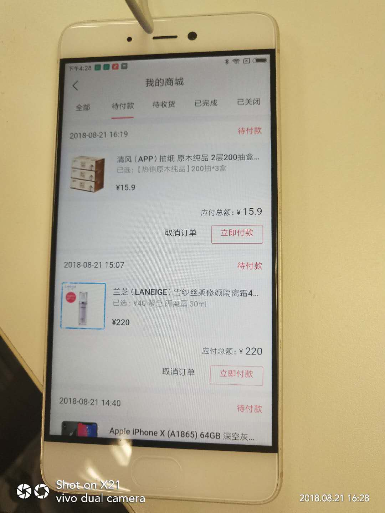
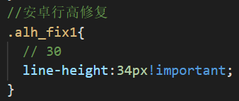
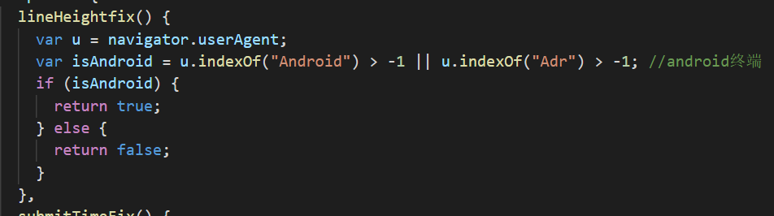
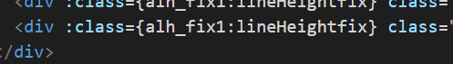

# line-height设置垂直居中，但是在Android的浏览器上总会偏上一点的解决办法

这个问题通过css是无法解决的，即使解决了也是一种通过微调来实现的hack方法，因为文字在content-area内部渲染的时候已经偏移了，而css的居中方案都是控制的整个content-area的居中。

导致这个问题的本质原因可能是Android在排版计算的时候参考了primyfont字体的相关属性（即HHead Ascent、HHead Descent等），而primyfont的查找是看`font-family`里哪个字体在fonts.xml里第一个匹配上，而原生Android下中文字体是没有family name的，导致匹配上的始终不是中文字体，所以解决这个问题就要在`font-family`里显式申明中文，或者通过什么方法保证所有字符都fallback到中文字体。

2个解决方案：

1. 不考虑向下兼容, (针对Android 7.0及以上设备)：<html>上设置 lang 属性：<html lang="zh-cmn-Hans">，同时font-family不指定英文，如 font-family: sans-serif 。这个方法是利用了浏览器的字体fallback机制，让英文也使用中文字体来展示，blink早期的内核在fallback机制上存在问题，Android 7.0+才能ok，早期的内核下会导致英文fallback到Noto Sans Myanmar，这个字体非常丑。

2. 对安卓设备进行针对性的微调:判断设备是不是安卓,如果是加入特殊类名,通过类名加大行高,把文字拉下来:

