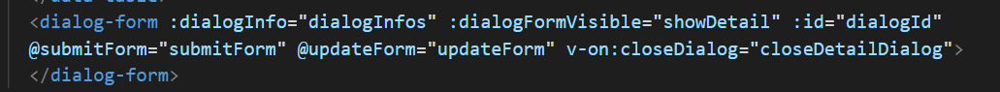
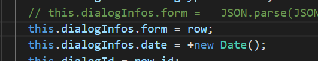
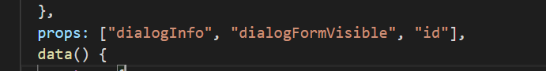
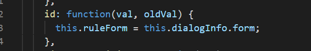
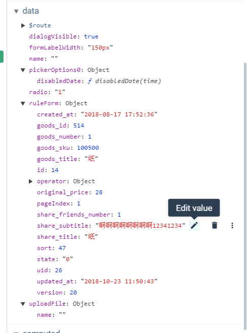
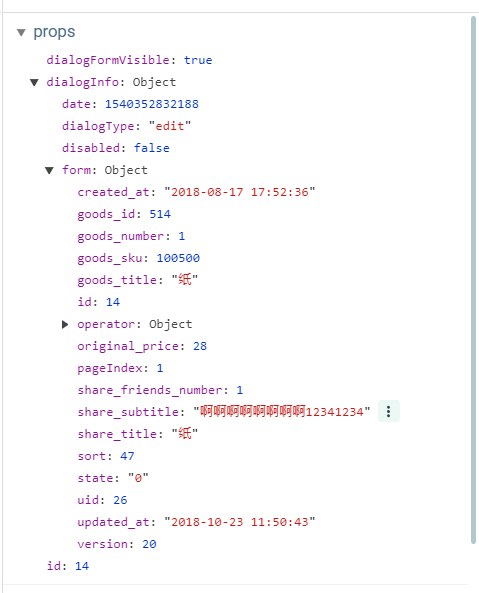
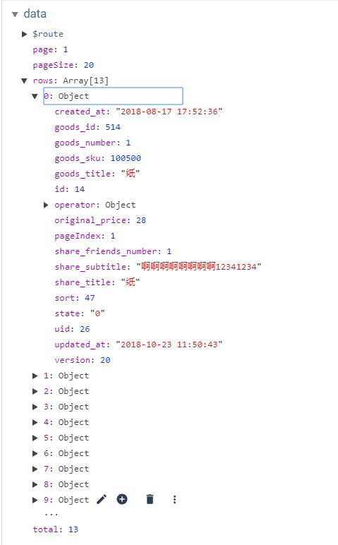
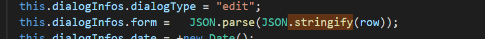

# vue 组件通信的坑

### 当传输的数据为引用类型时,一定要注意,有可能改了子组件的数据,父组件的数据也发生了改变

例子:

如给子组件传输数据:   dialogInfo

直接将行数据row(对象)赋值给: dialogInfos(dialogInfo)

在子组件中取值赋值: dialogInfo => ruleForm

 

但是问题来了!虽然经过了怎么几次赋值!但是 父组件row对象 与 子组件ruleFrom 仍然是一个对象, 他们在底层引用的是一个地址 => 一个对象

问题表现如下:

修改子组件数据:(ruleFrom.share_subtitle)

prop数据也变化了:(dialogInfo.form.share_subtitle)

父组件的行数据也变了:

 

以上问题的表明虽然 父 子 组件 的不同数据如果引用同一来源的引用数据,

虽然 用的是 不同 的 vue 观察者 , 然而 他们本质 却是 同一个 对象 ,

修改一个会改变其他的, 这会导致错误,正常情况子组件不能这样改变父组件的值!

 
 

 

### 解决方法:

最简单的方法是拷贝新的对象,赋值给子组件,做好隔离!

 

