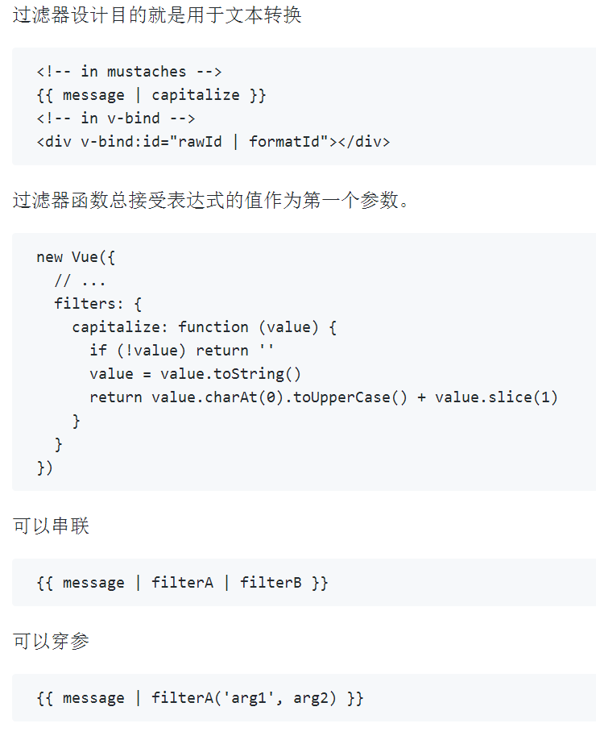

# vue模板语法核心
## Vue.js 使用了基于 HTML 的模版语法，允许开发者声明式地将 DOM 绑定至底层 Vue 实例的数据。
### 在底层的实现上， Vue 将模板编译成虚拟 DOM 渲染函数。
##### 结合响应系统，在应用状态改变时， Vue 能够智能地计算出重新渲染组件的最小代价并应用到 DOM 操作上。


## 插值
数据绑定 {{}}
```
<span>Message: {{ msg }}</span>

```
不更新 v-once
```
<span v-once>This will never change: {{ msg }}</span>
```
插入html v-html
```
<div v-html="rawHtml"></div>
```
插入属性 v-bind
```
<div v-bind:id="dynamicId"></div>

<button v-bind:disabled="someDynamicCondition">Button</button>
```
支持js单个表达式
```
{{ number + 1 }}
{{ ok ? 'YES' : 'NO' }}
{{ message.split('').reverse().join('') }}
<div v-bind:id="'list-' + id"></div>
```
只是单个表达式

 
 
## 指令
是否显示 v-if
```
<p v-if="seen">Now you see me</p>
```
绑定参数 v-bind
```
<a v-bind:href="url"></a>
```
监听事件 v-on
```
<a v-on:click="doSomething">
```
修饰符 .
```
<form v-on:submit.prevent="onSubmit"></form>
```
## 过滤器


## 缩写
v-bind :缩写
```
<!-- 完整语法 -->
<a v-bind:href="url"></a>
<!-- 缩写 -->
<a :href="url"></a>
```
v-on @缩写
```
<!-- 完整语法 -->
<a v-on:click="doSomething"></a>
<!-- 缩写 -->
<a @click="doSomething"></a>

```


