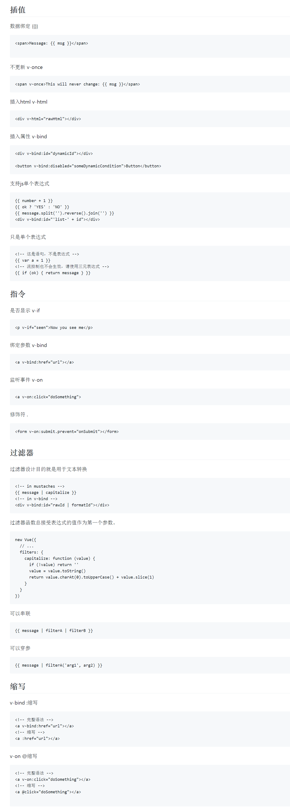

# vue模板语法核心
## Vue.js 使用了基于 HTML 的模版语法，允许开发者声明式地将 DOM 绑定至底层 Vue 实例的数据。
### 在底层的实现上， Vue 将模板编译成虚拟 DOM 渲染函数。
##### 结合响应系统，在应用状态改变时， Vue 能够智能地计算出重新渲染组件的最小代价并应用到 DOM 操作上。

### github会转化markdown文件为html,vue上的一些代码只能放图片
 

